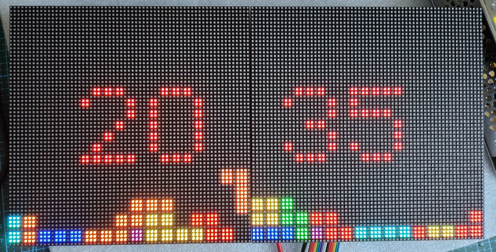

# AnimatedPixelClock

Early beta / work in progress: the project is already working and usable, with more
information coming over the next weeks and months.

An animated retro-arcade clock on a 128x64 RGB LED matrix, driven by an ESP32-S3.



[](https://youtu.be/dw6Jv9x7Knw)

[](https://youtu.be/dw6Jv9x7Knw)

Fourteen clock styles (Mario, Space Invaders, Pac-Man, Snake, Tetris, Asteroids, Dino
Runner, Matrix Rain, Missile Command and more), fully configurable from a built-in web
interface: per-element sprite
colors, brightness with scheduled night dimming, automatic timezone/DST, OTA updates.
It can also act as a PC performance monitor, showing live CPU/GPU/RAM/network stats
sent by a desktop companion app.

> Looking for the small OLED version? See the sibling project
> [SmallOLED-PCMonitor](https://github.com/Keralots/SmallOLED-PCMonitor).

## Hardware

| Part | Notes |
|------|-------|
| ESP32-S3 board | Developed on an ESP32-S3-WROOM-1 (N16R8) devkit; Waveshare ESP32-S3-Zero also supported |
| 2x [Waveshare P2.5 64x64 HUB75E panels](https://kamami.pl/en/matrix/1183428-waveshare-23708-rgb-full-color-led-matrix-panel-2-5mm-pitch-64x64-pixels-adjustable-brightness-5906623427154.html) | Chained into one 128x64 canvas, 1/32 scan, FM6126A driver (init handled by the firmware) |
| 5V PSU, ~10A | Power each panel directly, common ground with the ESP32 |

The panels run fine from the ESP32's 3.3V logic directly, no level shifters needed.
Full bench wiring, power-up order and first-light checklist:
**[docs/HUB75_WIRING.md](docs/HUB75_WIRING.md)** (with [pinout diagram](docs/hub75_wiring.svg)).

### Pin map

```
R1=1   G1=2   B1=4     R2=5   G2=6   B2=7
A=8    B=9    C=10     D=11   E=12
CLK=13 LAT=14 OE=38
```

The E line is required for 64x64 (1/32 scan) panels.

## Clock styles

| ID | Style | Description |
|----|-------|-------------|
| 0 | Mario | Mario jumps to bounce changed digits; optional idle enemy encounters |
| 1 | Standard | Traditional digital clock with date |
| 2 | Large | Extra-large digits |
| 3 | Space Invaders | Invader ship shoots lasers to change digits |
| 4 | Space Ship | Reserved variant of style 3 |
| 5 | Pong / Arkanoid | Breakout-style ball physics, digits shatter and reassemble |
| 6 | Pac-Man | Pac-Man eats pellet-based digits |
| 7 | Snake | Nokia-style snake hunts pellets left by changed digits |
| 8 | Tetris | Block digits rebuilt by slabs or falling dots, idle tetrominoes in classic piece colors |
| 9 | Cycle All Styles | Rotates through every style every 5 minutes |
| 10 | Asteroids | Wireframe ship shoots changed digits into spinning line shards |
| 11 | Dino Runner | Chrome T-Rex runs and jumps cacti; a pterodactyl swaps changed digits |
| 12 | Matrix Rain | Digital rain with fading glyph trails; changed digits decode out of the rain |
| 13 | Missile Command | Dotted missile trails rain on city silhouettes; explosion rings wipe changed digits |
| 14 | Weather Clock | Time plus live local weather: animated condition icon, temperature, daily range, humidity, sunrise/sunset |

Every style's sprite colors are individually editable in the web interface (digits,
characters, effects, backgrounds), so each clock can match your setup.

## Web interface

Once on WiFi, open the device's IP address or `http://pixelclock.local` in a browser:

- **Clock settings**: style, 12/24 hour, date format, position, per-style animation
  options, per-element colors with one-click reset to defaults
- **Display**: brightness (live slider), colon blink mode/rate, adaptive refresh rate,
  scheduled night dimming (start/end hour + dim level)
- **Timezone**: ~76 regions with automatic DST transitions (POSIX TZ database, no
  manual toggles)
- **Network**: DHCP or static IP, device name (mDNS), show IP at boot
- **PC monitor layout**: which metrics are visible and where, 5-row / 6-row / large
  text modes, progress bars, drag-and-drop placement on a live preview
- **Config export/import** as JSON (includes the color palette)
- **Firmware update**: upload a `.bin` over the air

## Weather (optional)

The Weather Clock (style 14) shows current conditions next to the time: an animated
icon (sun, clouds, rain, snow, storm...), the temperature, today's high/low, humidity
and sunrise/sunset times. When enabled it also joins the Cycle All rotation as an
extra screen.

Setup (web interface, Clock page, Weather Clock style):

1. Tick **Enable weather updates**.
2. Type your city into **Find your location** and press Search - it fills in the
   coordinates (the lookup runs in your browser; the device only stores latitude and
   longitude). You can also enter coordinates manually.
3. Pick Celsius or Fahrenheit. Save.

Data comes from [Open-Meteo](https://open-meteo.com/) (no account or API key needed),
fetched every 10 minutes. The optional API key field is only for Open-Meteo
commercial subscriptions. Icon, effect and temperature colors are editable in the
style's Colors card like any other clock.

## Ambient screensaver & seasonal effects

On the web interface's Display page you can run an **ambient screensaver** instead of
the clock: Doom fire (four palettes), plasma, lava lamp, starfield, an aquarium with
fish, bubbles and kelp, or a burning room where a very calm dog insists everything is
fine. An optional small clock stays in the corner. Press **Start
now** to keep the effect on until you stop it, or enable the schedule to have it come
on automatically during set hours (e.g. 20:00-23:00). `GET /api/mode/ambient` /
`/api/mode/auto` do the same from automations.

A separate **Holiday overlays** toggle adds date-driven effects over whatever clock
style is active: falling snow through December, a fireworks show around New Year's
midnight, floating hearts on February 14, and a pumpkin with passing bats in late
October. Off by default, one checkbox to enable.

## PC monitor mode (optional)

With the companion app running on your PC, the display switches to live hardware
stats (CPU/GPU temps and loads, RAM, disks, fans, network throughput; up to 20
metrics) and returns to the clock when the PC goes offline.

**Companion app v4** (Windows + Linux) lives in
[`PC-Companion-App-v4-beta/`](PC-Companion-App-v4-beta/): a tray app with a
web-style config window, live device preview, drag-and-drop layout editor and
sensor picker.

- **Windows**: run the prebuilt
  [`win-companion/dist/pc_stats_monitor_v4.exe`](PC-Companion-App-v4-beta/win-companion/),
  no Python needed. Install
  [LibreHardwareMonitor](https://github.com/LibreHardwareMonitor/LibreHardwareMonitor/releases)
  and run it as Administrator for temperature/fan/power sensors (on 0.9.5+ enable
  Options > Remote Web Server > Run).
- **Linux**: `cd PC-Companion-App-v4-beta/linux-companion`, then
  `python3 -m pip install -r requirements.txt` and
  `python3 pc_stats_monitor_v4_linux.py`.

Data is sent over local UDP (port 4210) as JSON, a few times per second at <1% CPU.

## Building and flashing

Built with [PlatformIO](https://platformio.org/).

```bash
# ESP32-S3-WROOM devkit (default)
pio run -e matrix-s3-wroom -t upload

# Waveshare ESP32-S3-Zero
pio run -e matrix-s3
```

The S3-Zero has no USB-UART chip: for the first flash hold BOOT while plugging in
USB, then use OTA. The `matrix-s3-bringup` / `matrix-wroom-bringup` environments
build a standalone panel self-test (`bringup/hello_matrix.cpp`) with six test
patterns, useful for verifying wiring before flashing the full firmware.

### First-time WiFi setup

On first boot the device opens an access point named **PixelClock-Setup**. Join it
and a captive portal (or `192.168.4.1`) lets you enter your WiFi credentials.
Improv-Serial provisioning over USB is also supported.

### OTA updates

After the initial flash, update over WiFi from the web interface's Firmware Update
section, or from the command line:

```bash
curl -F "firmware=@.pio/build/matrix-s3-wroom/firmware.bin" http://<device-ip>/update
```

## HTTP control API

Simple GET endpoints for home automation (Home Assistant, Node-RED, cron + curl).
All controls are runtime-only: they reset to the configured behavior after a reboot,
which avoids flash wear from frequent automation toggles. No authentication, so keep
the device on a trusted LAN.

| Endpoint | Description |
|----------|-------------|
| `/api/status` | Current display/mode state as JSON |
| `/api/display/off` / `/api/display/on` | Blank / restore the panel |
| `/api/display/brightness?value=0-100` | Set brightness (percent) |
| `/api/mode/clock` / `/api/mode/auto` | Force the clock / resume automatic mode |
| `/api/mode/ambient` | Force the ambient screensaver on now |
| `/api/clock/style?id=0-14` | Switch the clock style (IDs in the table above) |
| `/api/reboot` | Soft-restart (settings kept) |

```bash
curl http://pixelclock.local/api/display/off
curl "http://pixelclock.local/api/display/brightness?value=30"
curl "http://pixelclock.local/api/clock/style?id=8"
```

Home Assistant example:

```yaml
rest_command:
  clock_display_off:
    url: "http://pixelclock.local/api/display/off"
  clock_display_on:
    url: "http://pixelclock.local/api/display/on"
```

## Notifications API

Push a message banner onto the display from anything that can send an HTTP request.
The banner appears over whatever is on screen (clock or PC stats), scrolls if the
text is too long, and disappears on its own.

```bash
curl -X POST http://pixelclock.local/api/notify \
  -H "Content-Type: application/json" \
  -d '{"text":"Doorbell!","icon":"bell","color":"#FFAA00","duration":8000}'
```

| Field | Required | Description |
|-------|----------|-------------|
| `text` | yes | Message, up to 200 characters |
| `color` | no | Banner color as `#RRGGBB` (default white) |
| `icon` | no | One of `bell`, `mail`, `alert`, `heart`, `check`, `cross`, `info`, `home`, `music`, `star` |
| `duration` | no | Display time in ms, 1000-60000 (default 5000) |
| `position` | no | `top` or `bottom` (default: the position set in the web interface) |

`GET /api/notify/dismiss` clears the banner early. A new POST replaces the current
banner. The feature can be disabled entirely on the web interface's Display page
(Notifications card), where the default banner position is also set.

Home Assistant example:

```yaml
rest_command:
  clock_notify:
    url: "http://pixelclock.local/api/notify"
    method: POST
    content_type: "application/json"
    payload: '{"text":"{{ message }}","icon":"{{ icon | default(''info'') }}","color":"{{ color | default(''#FFFFFF'') }}"}'
```

## Libraries

- [ESP32-HUB75-MatrixPanel-DMA](https://github.com/mrcodetastic/ESP32-HUB75-MatrixPanel-I2S-DMA) (matrix driver)
- Adafruit GFX, WiFiManager (tzapu), ArduinoJson, Improv-Serial

## License

Open source. Feel free to modify and share.
